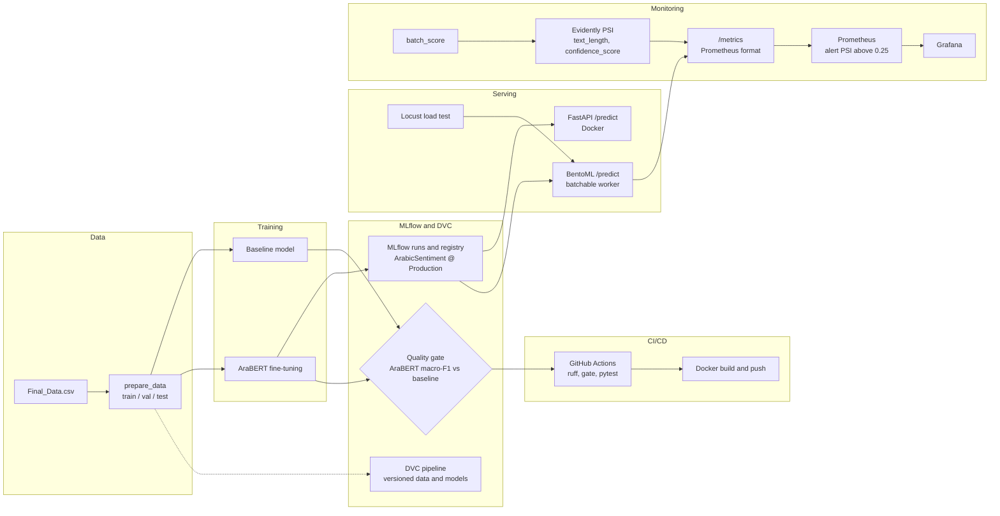
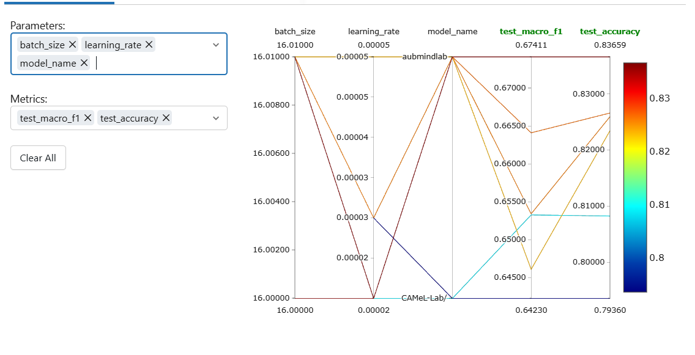
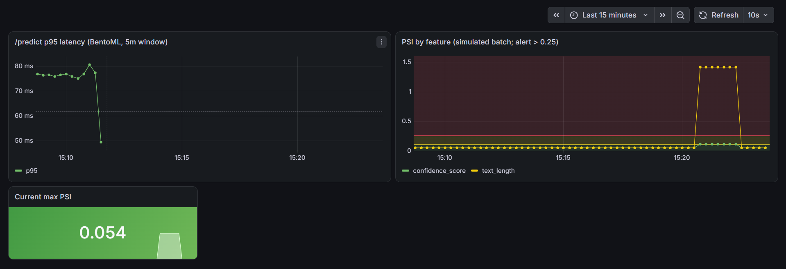
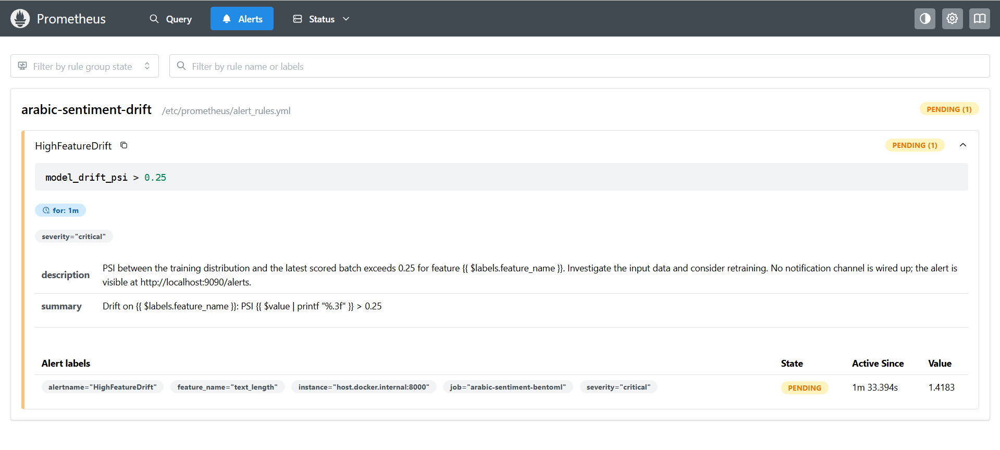
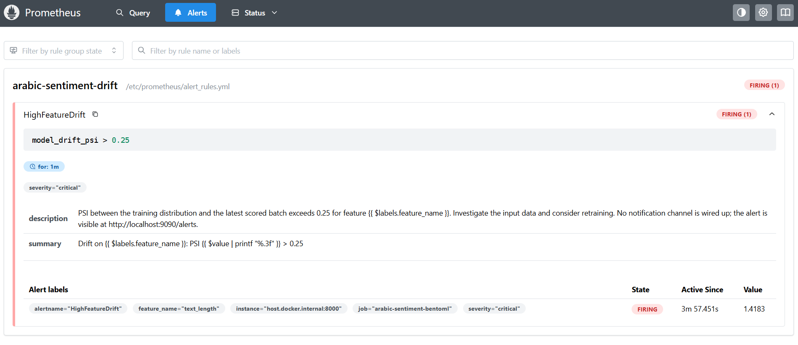

# Arabic Sentiment Analysis

An MLOps project that classifies Arabic customer reviews as **positive**, **neutral** or **negative**
with a fine-tuned AraBERT model. It covers the whole path: data versioning, training and tracking,
CI/CD, serving, load testing and drift monitoring.

> **Scope:** The model-optimization phase (distillation, INT8 quantization, TensorRT) was intentionally
> left out of this submission because there was not enough time, so the serving numbers below are a
> final benchmark, not a before/after comparison.

## Quickstart (3 commands)

```bash
dvc pull
docker compose up -d --build
curl -X POST http://localhost:8000/predict -H "Content-Type: application/json" -d '{"text": "\u0627\u0644\u0645\u0646\u062a\u062c \u0645\u0645\u062a\u0627\u0632"}'
```

Requires Docker and DVC (`pip install dvc`). Expected reply:
`{"label": "positive", "confidence": ..., "model_version": ...}`. The text is "المنتج ممتاز"
("the product is excellent"), written as JSON escapes so the command works in any terminal.
The model can take a minute to load: if the `curl` fails with a connection error or a 503, wait a
moment and retry (`docker compose ps` shows `(healthy)` when the API is ready).

> **Reviewer, please read first (DVC data).** The dataset and the model weights are not stored in
> git. They are tracked with DVC, and the DVC remote is a local folder named `dvc-storage` that is
> submitted **alongside** the repository, not inside it. `dvc pull` only works after you place that
> folder correctly:
> 1. Unzip `dvc-storage.zip` so the `dvc-storage` folder sits **next to** the repository folder
Download: https://drive.google.com/file/d/1xIglOOLjbUBK30LsE3a1dnejqut4mn2m/view?usp=sharing
>    (both in the same parent directory).
> 2. Run `dvc pull` from the repository root.
>
> If you keep the folder somewhere else, point DVC at it first:
> `dvc remote modify --local localstorage url /path/to/dvc-storage`.
> Without this folder `dvc pull` fails. The Docker container then still starts, but it reports
> unhealthy and `/health` returns 503, because the model weights are missing.

Check health with `curl http://localhost:8000/health`. Stop with `docker compose down`.
An empty `text` returns a 422.

## Dataset

- **Source:** https://www.kaggle.com/datasets/mohamedramadan2040/arabic-customer-reviews?select=Final_Data.csv
- **File:** `data/raw/Final_Data.csv` (tracked with DVC). 
- **Content:** Arabic customer reviews, dialectal and Modern Standard Arabic, with the columns
  `review_description` (text), `rating` (positive / neutral / negative) and `company`
  (for example `talbat`, `swvl`, `telecom_egypt`).
- **Cleaning:** 29 rows with missing values or duplicates were dropped, leaving 40,017 reviews.
- **Split:** 70 / 15 / 15 into train 28,011, validation 6,003 and test 6,003 rows (`data/processed/`).
- **Class balance:** imbalanced. Neutral is only about 5% of the test set (288 of 6,003 rows),
  which is why the project uses macro-F1.

## Architecture



There is no optimization stage in this diagram (see the scope note above).

## Changelog (session by session)

| Stage | What was built |
|---|---|
| **01 Packaging** | `src/` layout with `pyproject.toml`, data preparation (`data_prep.py`), a baseline model, and AraBERT fine-tuning wrapped in a typed class (`TransformerSentimentModel`). |
| **02 API** | FastAPI service: `POST /predict` takes `{"text": str}` and returns `{label, confidence, model_version}`, `GET /health`, Pydantic validation that rejects empty text. The model is loaded from the MLflow registry (`ArabicSentiment@Production`). |
| **03 Docker** | `Dockerfile` (CPU PyTorch, uvicorn), `docker-compose.yml` serving on port 8000, `.dockerignore`. |
| **04 MLflow + DVC + CI/CD** | MLflow tracking and model registry (`ArabicSentiment` promoted to Production). DVC pipeline `prepare_data → train_baseline → train_arabert → evaluate` with a local remote. GitHub Actions: ruff → quality gate → pytest → Docker build and push. Macro-F1 quality gate. Pytest suite against an isolated temporary MLflow registry. |
| **05 BentoML + Locust** | BentoML service with a `batchable=True` worker behind a single-text `/predict`, plus a Locust load test. This is the **final serving benchmark**, with no optimization to compare against. |
| **06 Monitoring** | Evidently PSI for `text_length` and `confidence_score`, triggered automatically after every batch-scoring run, exposed at `/metrics`, scraped by Prometheus with a drift alert, and shown in a Grafana dashboard. |

## Quality gate: AraBERT must beat the baseline

`src/arabic_sentiment/evaluate.py` is the last stage of the DVC pipeline (`dvc repro`).
It scores both models on the same held-out test split (6,003 rows) and exits with code 1
if AraBERT's test macro-F1 is below the baseline's, which fails `dvc repro` and any CI job
that runs it.

| Model    | Test macro-F1 |
|----------|---------------|
| Baseline | 0.6153        |
| AraBERT  | 0.6641        |

**Why this gate**
- A transformer is only worth its serving cost if it beats the simple baseline. The gate
  blocks regressions caused by retraining, data changes or code changes.
- It uses macro-F1, not accuracy. The classes are imbalanced (neutral is about 5% of the
  test set). The baseline reaches 0.78 accuracy but only 0.21 F1 on neutral. Macro-F1
  weights every class equally, so a model that ignores the minority class cannot pass.
- The comparison uses the baseline recomputed on the current split. The documented
  reference value (0.6153) is a sanity check: if the recomputed baseline differs by more
  than 0.005, `evaluate.py` prints a warning, because the data split or baseline changed.

**In CI** the gate runs as `python src/arabic_sentiment/evaluate.py --check-only`. It reads the
committed `results/metrics.json` and exits 1 if AraBERT's macro-F1 is below the baseline's, so the
runner needs no model or data. `dvc repro` recomputes `results/metrics.json` locally, and the file
must be committed whenever the models or data change.

## Experiment tracking

17 runs were logged in MLflow, comparing two Arabic BERT models
(`aubmindlab/bert-base-arabertv2` and `CAMeL-Lab/bert-base-arabic-camelbert-mix`)
at learning rates from 2e-5 to 5e-5. The plot shows `model_name`, `learning_rate`,
`batch_size`, `test_macro_f1` and `test_accuracy` per run. Metric names in the runs are
`learning_rate`, `test_accuracy` and `test_macro_f1`; some runs log the batch size as
`effective_batch_size` (per-device 8 × gradient accumulation 4).



## Serving benchmark (final, no optimization baseline)

This is the **final serving benchmark** of the Production AraBERT model behind BentoML.
There is no "before" number to compare against (see the scope note at the top).

- **Setup:** `bentoml models list` must show `arabert_production` (created by
  `python src/arabic_sentiment/save_bento.py`). Stop the Docker FastAPI service first, because
  both use port 8000.
- **Service:** `bentoml serve src.arabic_sentiment.bento_service:AraBERTService --port 8000`.
  `/predict` takes `{"text": "..."}` and returns `{"label", "confidence", "model_version"}`,
  the same schema as the FastAPI version. Concurrent requests are merged by a
  `batchable=True` worker (max batch 32, max latency 1000 ms).
- **Hardware:** CUDA GPU available, CPU Intel64 Family 6 Model 154 (GenuineIntel). The service
  and Locust ran on the same machine.
- **Load:** `locust -f locustfile.py --headless -u 50 -r 5 -t 60s --host http://localhost:8000 --html reports/locust_report.html`
- **Result:** 4,731 requests, **0 failures**. Median 220 ms, **p95 650 ms**, p99 about 2 s.
- **Report:** `reports/locust_report.html`

## Monitoring

The BentoML service exposes Prometheus metrics at `/metrics`: request latency
(BentoML's built-in histogram) and the PSI drift score per feature (`text_length`,
`confidence_score`). PSI is computed by Evidently after each batch-scoring run
(`python -m src.arabic_sentiment.batch_score <csv>`), comparing a baseline of training data
(`data/reference_baseline.csv`) against the scored batch, and the result is written to
`reports/drift_latest.json`, which `/metrics` reads. The Evidently report is saved to
`reports/drift_report.html`.

There is no live traffic yet. PSI comes from batch-scoring runs on held-out test data, and a
simulated shift was used to demonstrate the alert (screenshots below). The values show the
mechanism, not real production drift.

Start the service, then the monitoring stack:

    bentoml serve src.arabic_sentiment.bento_service:AraBERTService --port 8000
    docker compose -f docker-compose.monitoring.yml up -d

- Grafana: http://localhost:3000 (admin / admin), dashboard "Arabic Sentiment - Model Monitoring"
  with three panels: `/predict` p95 latency, PSI by feature, and current max PSI.
- Prometheus: http://localhost:9090



### Drift alert rule

Defined in `monitoring/alert_rules.yml`:

| Field | Value |
|---|---|
| Alert | `HighFeatureDrift` |
| Condition | PSI > 0.25 (per feature) for 1 minute |
| Severity | critical |

0.25 follows the common PSI rule of thumb: below 0.1 is stable, 0.1 to 0.25 is a
moderate shift, above 0.25 is a significant shift. The rule is evaluated by
Prometheus and visible at http://localhost:9090/alerts. No Alertmanager or
notification channel is configured; routing it to Slack or email would be the
next step.

| Pending (condition true, waiting out the 1 minute) | Firing |
|---|---|
|  |  |

## Development

```bash
pip install -e ".[dev,serving]"
dvc pull   #data and model weights (needs the shared dvc-storage folder, see Quickstart).
dvc repro                     # re-runs only the stages whose inputs changed
ruff check . && pytest -q
```

In the reproducibility check, `dvc repro` reproduced the baseline exactly (test macro-F1 0.6153).
The AraBERT stage was unchanged and skipped, so AraBERT retraining was not re-run for that check.

## Repository layout

```
src/arabic_sentiment/   data_prep, baseline_model, train_transformer, evaluate (+ gate),
                        api (FastAPI), bento_service, save_bento, batch_score, monitor_drift
tests/                  API tests (isolated MLflow registry), drift tests, monitoring config tests
monitoring/             Prometheus config, alert rules, Grafana dashboard and provisioning
dvc.yaml, dvc.lock      data and training pipeline
.github/workflows/      CI/CD (ruff, gate, pytest, Docker build and push)
reports/                Locust report, Evidently drift report
docs/images/            Grafana and alert screenshots
```